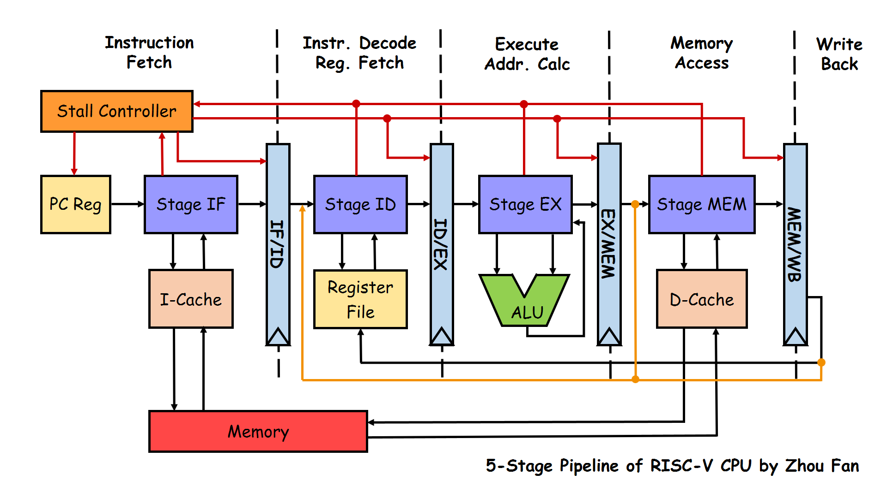
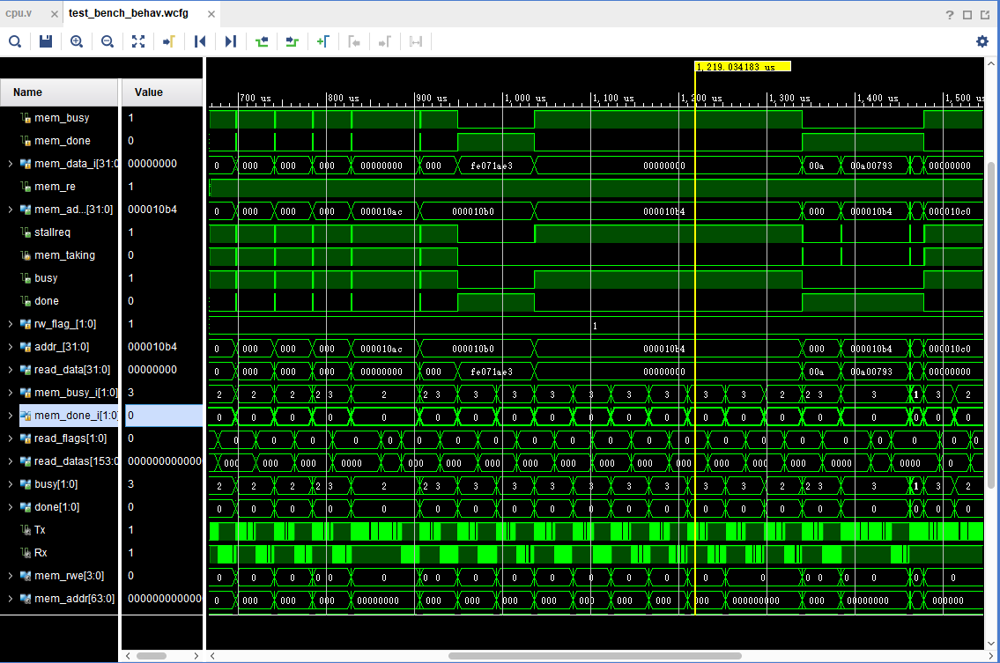
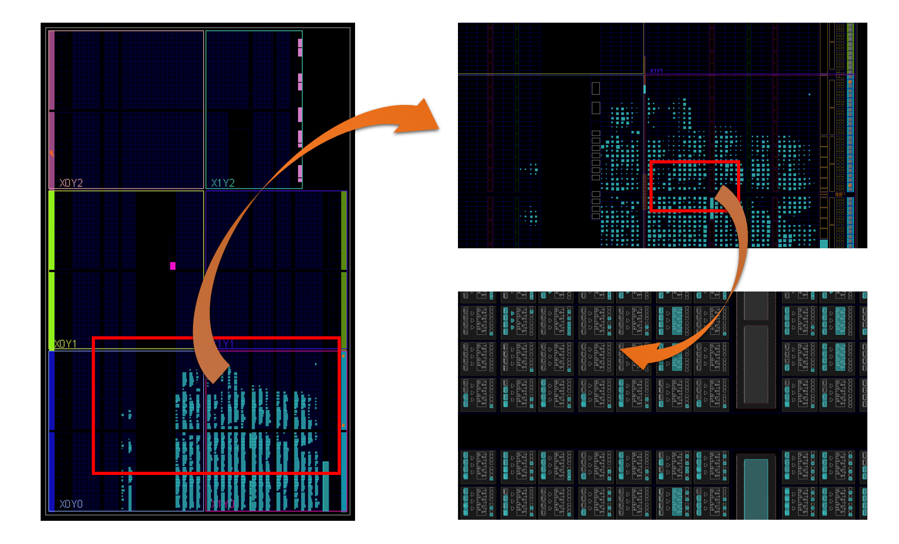
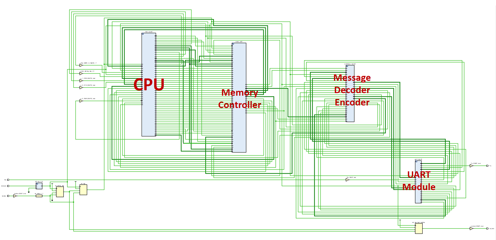
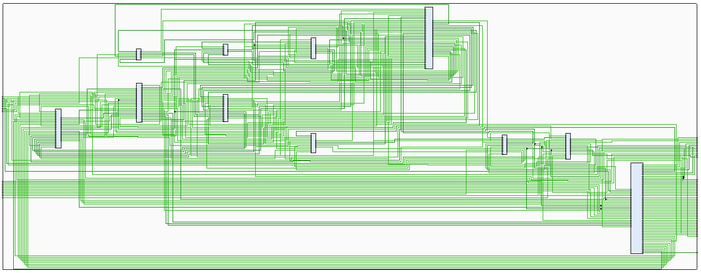

# RISC-V CPU

Zhou Fan (范舟)

This project is a RISC-V CPU with 5-stage pipeline implemented in Verilog HDL, which is a course project of Computer Architecture, ACM Class @ SJTU.

## Documents

* My [**Project Report**](doc/project-report.pdf)
* My [blog post](http://blog.evensgn.com/riscv-gnu-toolchain/) for installation and usage of RISV-V GNU toolchain (In Chinese) ([on GitHub](doc/riscv-toolchain-installation-usage.md))
* [RISC-V 32I subset](doc/inst-supported.md) supported in this CPU project

## Design
 Feature | RISC-V CPU
--- | ---
ISA | RISC-V ([RV32I subset](doc/inst-supported.md))
Pipelining | 5 stages
Data forwarding | √
Cache | N-way set associate I-cache and D-cache [1]
UART module | passed simulation [2]
Security | perfect proof against Meltdown and Spectre attack [3]

- [1] The cache is based on [Zhekai Zhang's code](https://github.com/sxtyzhangzk/mips-cpu/blob/master/src/cpu/cache.v)
- [2] UART module has not passed test on FPGA yet for the limited time. I re-designed part of CPU code to avoid hidden danger on FPGA, and it may need some more debugging.
- [3] Just kidding ;-) That's because the CPU is not with branch prediction or out-of-order execution.

This CPU project has a five stage pipeline with data forwarding.
In the picture below, red paths show stall control flow, while orange ones show data forwarding path.

For program test on FPGA without capable memory, this CPU uses UART protocol to communicate with PC, where runs a memory simulator.

## Simulation
This CPU is simulated with UART communication module in Xilinx vivado.

## Implementation
Implementation on Basys3 FPGA, using Xilinx vivado.

Scematic Overview

CPU Module Scematic

## References

* 雷思磊. 自己动手写 CPU. 电子工业出版社, 2014.
* John L. Hennessy, David A. Patterson, et al. Computer Architecture: A Quantitative
Approach, Fifth Edition, 2012.
* David A. Patterson. PPT of CS252 Graduate Computer Architecture, 2001.
* [Zhekai Zhang's CPU project](https://github.com/sxtyzhangzk/mips-cpu)
* [Verilog: always @ Blocks by Chris Fletcher](doc/Always@.pdf)